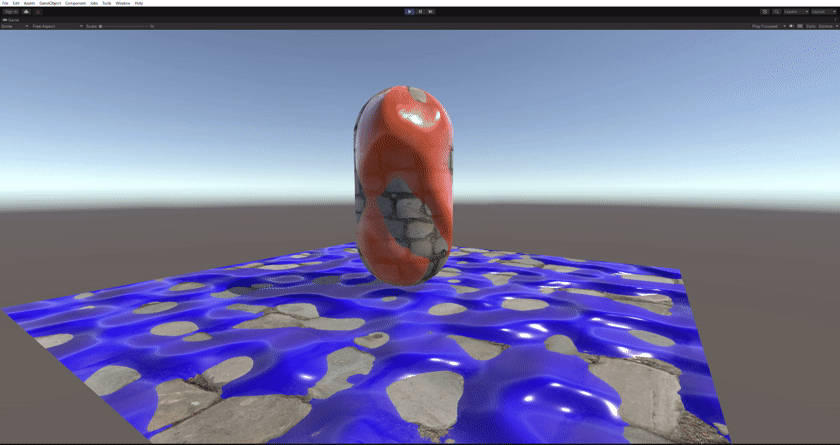
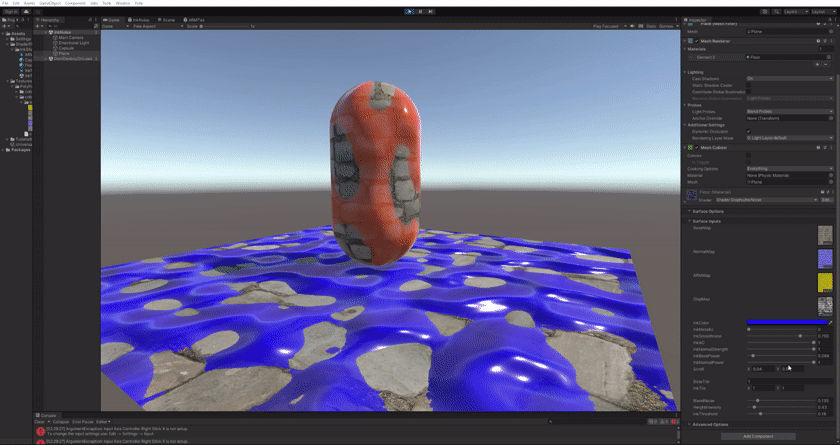
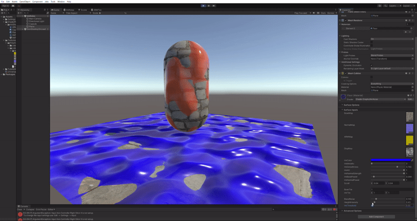

# Unity ShaderPlaygroundURP

[WebGL Demo](https://gam0022.net/ShaderPlaygroundURP/)

## InkShader

- シーン
    - [Assets/ShaderPlaygroundURP/InkShader/InkNoise.unity](https://github.com/gam0022/ShaderPlaygroundURP/blob/main/Assets/ShaderPlaygroundURP/InkShader/InkNoise.unity)
- 解説記事
    - [UnityのShaderGraphでインクシェーダーを作る | gam0022.net](https://gam0022.net/blog/2022/12/25/unity-ink-shader/)

## Mayu Shader

学園アイドルマスターの眉毛シェーダー（正面から見ると眉毛が前髪より手前に、横顔に近づくと眉毛がフェードアウトする処理）を再現する試みです。

- シーン
    - [Assets/ShaderPlaygroundURP/Mayu/MayuDepthOffset.unity](https://github.com/gam0022/ShaderPlaygroundURP/blob/main/Assets/ShaderPlaygroundURP/Mayu/MayuDepthOffset.unity)
- 解説記事
    - [学園アイドルマスターの眉毛のShaderをUnityで再現してみた | gam0022.net](https://gam0022.net/blog/2024/05/29/gakumasu-mayuge-shader/)

UnityちゃんシリーズのSDトーコちゃんの3Dモデルを使わせていただきました。

# License

ソースコードはMITライセンスとしますが、アセットについてはプロジェクトファイル内にあるLicenseファイルにしたがってください。

- Unity Chan: © Unity Technologies Japan/UCL

シェーダーやソースコードを参考にした場合は、必ずクレジットをお願いします。